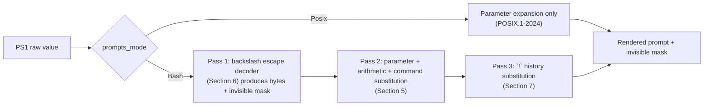

# PS1 Prompt Extensions

## Status

**Implemented.** The `bash_prompts` shell option is accepted by `set -o` / `set +o` ([src/shell/options.rs](../../src/shell/options.rs)) and is mutually exclusive with the implicit POSIX mode. The backslash-escape decoder, the `Prompt` type that carries an invisible mask for `\[...\]` regions, and the per-session command counter (`\#`) live in [src/interactive/prompt_expand.rs](../../src/interactive/prompt_expand.rs). PS1/PS2 expansion, PS4 xtrace expansion, and the line editor's cursor-column arithmetic consume the invisible mask via `display_width_visible` in [src/interactive/editor/redraw.rs](../../src/interactive/editor/redraw.rs). Locale-aware `\D{format}` uses the `strftime(3)` wrapper in [src/sys/time.rs](../../src/sys/time.rs). The `PS4` first-character duplication per subshell nesting level (§ 3.5) is implemented in the xtrace writer ([src/exec/simple.rs](../../src/exec/simple.rs)) using a per-shell depth counter set at every subshell-entry site. The `read -p` prompt option (§ 12.3) is implemented in [src/builtin/read.rs](../../src/builtin/read.rs) and writes its argument verbatim — explicitly bypassing the escape pass. User-visible behavior is verified by unit tests colocated with the decoder, the `read` builtin unit suite, and integration tests in [tests/integration/prompt.rs](../../tests/integration/prompt.rs); the interactive `\#` increment and `!`-from-parameter-expansion paths are exercised end-to-end through the PTY harness in [tests/integration/interactive_common/](../../tests/integration/interactive_common/).

## 1. Scope

This document is the authoritative specification of the prompt-rendering language used by meiksh for `PS1`, `PS2`, `PS3`, and `PS4`. It defines:

- A prompts-mode gate (`bash_prompts`) that distinguishes strict POSIX prompt expansion from the bash-style extended language.
- The full expansion pipeline and its order of operations.
- The set of backslash escape sequences recognized inside prompts.
- The semantics of the non-printing-region delimiters `\[` and `\]` and the contract between them and the line editor's cursor arithmetic.
- The interaction between `\!`, literal `!`, and history substitution.

No external standard describes extended prompt expansion. POSIX.1-2024 specifies only that prompt variables are subjected to parameter expansion before being written; everything else in this document is a non-POSIX extension. The GNU Bash manual, `ksh93` manual, and `zshmisc(1)` are product documentation for their respective implementations, not specifications. Meiksh therefore owns its own spec for this feature, aligned with bash where bash, ksh, and zsh converge, and deliberately divergent where the three disagree.

### 1.1 Conformance Language

The key words "shall", "shall not", "should", "should not", "may", and "must" in this document are to be interpreted as described in RFC 2119. Text following a bulleted `shall` requirement constitutes a normative requirement that meiksh conformance tests verify.

### 1.2 De-Facto Reference

Where this document intentionally aligns with existing practice, the de-facto reference is:

- GNU Bash 5.2, `PROMPTING` section of `bash(1)`.
- ksh93, `PS1` through `PS4` in `ksh(1)`.
- zsh 5.9, `EXPANSION OF PROMPT SEQUENCES` in `zshmisc(1)`.

Meiksh aligns with bash's prompt escape language because it is the widest deployed; zsh's `%`-prefixed alternative language is out of scope for this document and is reserved for a future `zsh_prompts` mode (see Section 13.3).

### 1.3 Non-Goals

This specification intentionally omits a number of features that exist in the reference shells. The omissions are listed normatively in Section 13 (Non-Goals). Appendix B describes what it would take to add each omitted feature later. The absence of a feature from this document shall not be interpreted as an oversight.

### 1.4 Companion Policy Documents

This specification is written against two project-wide policy documents, which take precedence over any conflicting guidance implied here:

- [docs/IMPLEMENTATION_POLICY.md](../IMPLEMENTATION_POLICY.md) is the canonical source for project rules that implementation of this spec must follow, in particular: the `libc`-boundary rule (production `libc` calls live only under `src/sys/`, integration-test `libc` usage lives only in `tests/integration/sys.rs`); the banned-`std` list (no `std::fs::File`, `std::process::Command`, `std::string::String`, `std::path::{Path, PathBuf}`, `std::env::var`, `println!`/`format!`/`write!`, and so on; use `Vec<u8>` / `&[u8]` with `sys::` wrappers and `bstr::ByteWriter`); and the `ShellMap` / `ShellSet` requirement for byte-string-keyed hash tables. Every implementation decision made in Section 11 (Implementation Notes) of this spec is a direct consequence of those rules; if the two documents disagree, `IMPLEMENTATION_POLICY.md` wins.
- [docs/TEST_WRITING_GUIDE.md](../TEST_WRITING_GUIDE.md) is the canonical source for how the unit and integration tests that verify this spec shall be structured, including the unit-vs-integration split, the `trace_entries!` / `syscall_test!` conventions for fake-syscall unit tests, and the PTY-harness conventions for interactive integration tests. Every test-shape requirement made in Section 14 (Testing) of this spec shall be interpreted in light of that guide; if the two documents disagree, `TEST_WRITING_GUIDE.md` wins.

## 2. Prompts-Mode Gate

### 2.1 The `bash_prompts` Option

- `set -o bash_prompts` shall enable the bash-style prompt expansion language defined by this document.
- `set +o bash_prompts` shall disable it, reverting every prompt variable to strict POSIX parameter expansion as defined in Section 4.
- The default value of `bash_prompts` on shell startup shall be off, for both interactive and non-interactive shells. A fresh meiksh invocation is strict POSIX.
- The reportable options output produced by `set -o` shall include the line `bash_prompts      on` or `bash_prompts      off` reflecting the current state, using the same column formatting used by the other POSIX `set -o` options.
- `bash_prompts` shall not be exposed through a short option letter. The value of `$-` shall not gain a new character when `bash_prompts` is enabled.

#### 2.1.1 Naming Rationale

The option name encodes two facts: **what** the option enables (a prompt-escape language) and **whose** escape syntax it implements (bash's — Brian Fox introduced `\u`, `\h`, `\w`, `\d`, `\t`, `\!`, `\#`, `\$`, `\[`, `\]`, `\D{…}` with bash 1.0 in 1989, predating ksh93 and zsh adoptions of any subset). This follows the zsh convention of naming cross-shell-borrowed options after their source shell (`BASH_REMATCH`, `KSH_ARRAYS`, `CSH_NULL_GLOB`, `POSIX_CD`, …) so the provenance is visible at the call site.

The narrower name — `bash_prompts` rather than an umbrella like `bash_compat` — reflects that the option gates exactly one feature today. If meiksh grows additional bash-flavored extensions later (bash arrays, `[[ ]]`, process substitution, `=~`), each shall be gated by its own `bash_*` option. A top-level `bash_mode` flag or `emulate bash` builtin is out of scope for this document; see Appendix B, Package 8 for the sketch of how such a bundler would sit on top of the per-feature options.

### 2.2 The Prompts-Mode Slot

- The shell shall maintain a single-valued prompts-mode selector. At any given time exactly one prompts mode is active; the default selector value is `POSIX`, meaning no non-POSIX prompt escape language is decoded.
- Enabling `bash_prompts` shall set the selector to `Bash`. Disabling `bash_prompts` shall set the selector to `POSIX`.
- Future prompts options (for example `zsh_prompts`, `ksh_prompts`) shall share the same selector. Enabling one of them shall atomically disable every sibling. This mirrors the mutual exclusion between `set -o vi` and `set -o emacs`.
- Disabling the currently-active prompts option shall leave the selector at `POSIX`; it shall not reactivate a previously-selected prompts option.

### 2.3 Capture Semantics

- Each prompt expansion shall capture the value of the prompts-mode selector exactly once, at the top of the expansion. Changes to the selector during parameter or command substitution inside that same prompt shall not affect the current expansion's behavior.
- The next prompt expansion shall observe the updated selector. There is no hysteresis and no deferred flip.

### 2.4 Non-Interactive Shells

- Non-interactive shells shall honor `set -o bash_prompts` to the extent that prompt variables are expanded at all (notably `PS4` for `xtrace`). `set -o bash_prompts` in a non-interactive shell shall therefore enable bash-style escapes in the `PS4` trace output.

## 3. Prompt Variables

### 3.1 Variable Set

Meiksh recognizes four prompt variables. Their defaults and escape behavior are:

| Variable | Default value | Escape pass when `bash_prompts` is on | Parameter + arithmetic + `$(...)` | `!` history substitution |
|---|---|---|---|---|
| `PS1` | `$ ` for a non-root effective UID, `# ` for root (see Section 3.2) | Yes | Yes | Yes |
| `PS2` | `> ` | Yes | Yes | Yes |
| `PS3` | `#? ` | No (bash parity) | Yes | No |
| `PS4` | `+ ` | Yes | Yes | No |

With `bash_prompts` off, every row collapses to "parameter expansion only, no `!` expansion, no escape decoding" per Section 4.

### 3.2 PS1 Default

The default value of `PS1` shall be the literal string `$ ` for a non-root effective UID and `# ` for the root effective UID, regardless of the `bash_prompts` setting. The `bash_prompts` option gates backslash-escape *decoding* on whatever raw `PS1` value is in effect; it never substitutes a different default. In particular, enabling `bash_prompts` without setting `PS1` shall not produce a bash-style `\s-\v\$ ` prompt — `\s-\v\$ ` is not treated as a default anywhere in meiksh. Users who want the shell name and version in their prompt shall set `PS1` explicitly.

The `$ ` / `# ` default value is selected at shell-startup time based on `geteuid()` and is seeded into the shell's variable store *before* any startup file is sourced (see `load_startup_files` in [src/interactive/startup.rs](../../src/interactive/startup.rs)). Seeding early ensures that `/etc/profile` gates of the form `[ "${PS1-}" ]` observe `PS1` as set and proceed with their interactive-shell configuration. The seed is not exported; child processes that need `PS1` shall set it themselves. A shell that inherits `PS1` from its environment keeps the inherited value unchanged. The default value is chosen because strict POSIX explicitly prescribes `"$ "` as the `PS1` value unless the user is privileged, in which case an implementation-defined alternative ending in `# ` is conventional across historical UNIX shells.

### 3.3 PS2 Default

The default value of `PS2` shall be the literal string `> ` regardless of prompts mode.

### 3.4 PS3 Default

`PS3` is read by the `select` builtin when prompting for a selection. Its default value shall be `#? `. `PS3` is never subjected to the backslash-escape pass regardless of prompts mode; this matches bash.

### 3.5 PS4 Default

`PS4` is read by the shell when tracing command execution under `set -o xtrace`. Its default value shall be `+ `. When the rendered value of `PS4` is longer than a single character, the first character shall be duplicated once per level of subshell nesting, matching bash. The backslash-escape pass is applied to `PS4` when `bash_prompts` is on; the invisible-region mask from `\[...\]` is discarded because xtrace output is not cursor-positioned.

### 3.6 Lifecycle

- Prompt variables shall be re-expanded on every prompt write. Meiksh shall not cache the expanded value.
- A prompt variable that becomes unset shall fall back to its default from Sections 3.2-3.5.
- A prompt variable that is set to the empty string shall produce an empty prompt; the shell shall not substitute the default.

## 4. Strict POSIX Expansion (`bash_prompts` off)

When the prompts-mode selector is `POSIX`, the prompt expansion pipeline shall consist of a single pass:

- `PS1`, `PS2`, `PS3`, `PS4` shall each be subjected to parameter expansion per POSIX.1-2024 §2.6. This includes `$name`, `${name}`, `${name:-word}`, command substitution `$(...)` and backticks, and arithmetic expansion `$((...))`.
- Backslashes shall be literal bytes. The sequences `\u`, `\h`, `\w`, `\t`, `\$`, `\[`, `\]`, `\D{...}`, and every other escape listed in Section 6 shall be emitted as their raw two-byte forms.
- A literal `!` in the prompt shall be emitted as `!`. The `expand_prompt_exclamation` pass defined for bash mode (Section 7) shall not run.
- The output of expansion is a byte string only; there is no invisible-region mask, and the line editor shall treat every rendered byte as visible for cursor-column math (after normal multibyte and wide-char handling).
- `PS3` and `PS4` in POSIX mode behave identically to `PS1`: parameter expansion only.

This pipeline matches POSIX.1-2024 §2.5.3 literally. It is the meiksh default.

## 5. Bash-Prompts Expansion Pipeline

When the prompts-mode selector is `Bash`, the prompt expansion pipeline shall consist of three ordered passes against the raw value of the prompt variable:

1. **Escape pass.** The backslash-escape decoder defined in Section 6 is applied to the raw string. It produces two outputs: a rendered byte string, and an invisible-region mask recording which byte ranges originated between `\[` and `\]`.
2. **Parameter pass.** The rendered byte string from pass 1 is subjected to parameter expansion, arithmetic expansion, and command substitution, exactly as in strict POSIX mode. The invisible-region mask is rewritten to align with the expanded byte stream: bytes introduced by parameter expansion are visible, and bytes removed shrink the corresponding invisible ranges if any.
3. **History pass.** The output of pass 2 is scanned for literal `!` characters; each literal `!` is replaced with the history number of the command about to be read (Section 7). This pass applies to `PS1` and `PS2` only; `PS3` and `PS4` skip it.

The ordering is normative. Rationale:

- Pass 1 must precede pass 2 so that `\$` produces a literal `$` that parameter expansion then treats as a normal character rather than reinterpreting as the start of a parameter reference.
- Pass 2 must precede pass 3 so that a variable containing a literal `!` in its value is not re-scanned for history substitution (this matches bash's `promptvars` semantics).
- The invisible-region mask is threaded through all three passes so that `\[...\]` wrapping a variable that contains a color escape sequence (for example `PS1='\[$LP_COLOR_USER\]\u\[$LP_COLOR_RESET\]'`) still hides the expanded color bytes from cursor math.

The pipeline is summarized below.



## 6. Backslash Escape Set

This section is active only when `bash_prompts` is on. In POSIX mode the bytes described here are emitted verbatim.

The table below enumerates every backslash escape recognized by the escape pass. Escapes not listed shall be emitted as their raw two bytes (the backslash followed by the next byte). This is the bash-compatible "unknown escape" behavior and shall not produce a diagnostic.

### 6.1 Escape Table

| Sequence | Output |
|---|---|
| `\a` | The byte `0x07` (BEL). |
| `\d` | Shorthand for `\D{%a %b %e}` (see Section 6.3). |
| `\D{format}` | `strftime(3)` applied to `format` against the current local time. See Section 6.3. |
| `\e` | The byte `0x1B` (ESC). |
| `\h` | The host name up to but not including the first `.`, as returned by `gethostname(2)`. If `gethostname` fails, the string `?` shall be emitted. |
| `\H` | The full host name as returned by `gethostname(2)`. If `gethostname` fails, the string `?` shall be emitted. |
| `\j` | The decimal count of jobs currently managed by the shell. |
| `\l` | The basename of the shell's controlling terminal device, as obtained via `ttyname(3)` on file descriptor 0. If `ttyname` fails, the string `tty` shall be emitted. |
| `\n` | A newline (`0x0A`). |
| `\r` | A carriage return (`0x0D`). |
| `\s` | The shell's invocation name, stripped of any leading path components. This is the basename of `$0` at startup. |
| `\t` | Shorthand for `\D{%H:%M:%S}`. |
| `\T` | Shorthand for `\D{%I:%M:%S}`. |
| `\@` | Shorthand for `\D{%I:%M %p}`. |
| `\A` | Shorthand for `\D{%H:%M}`. |
| `\u` | The current value of `$USER` if set and non-empty. If `$USER` is unset or empty, the shell shall call `getpwuid(geteuid())` and emit its `pw_name` field. If both sources fail, the string `?` shall be emitted. |
| `\v` | The meiksh version string in the form `MAJOR.MINOR`. |
| `\V` | The meiksh version string in the form `MAJOR.MINOR.PATCH`. |
| `\w` | The current working directory with `$HOME` collapsed to `~` (Section 6.2). |
| `\W` | The basename of the current working directory. If the current working directory equals `$HOME`, the output shall be `~`. |
| `\!` | The history number of the command about to be read (Section 7.1). |
| `\#` | A per-session command counter (Section 6.4). |
| `\$` | `#` if `geteuid()` returns 0; `$` otherwise. |
| `\nnn` | The byte whose octal value is `nnn`, where `n` is an octal digit (Section 6.5). |
| `\\` | A single literal backslash byte. |
| `\[` | Begin a non-printing region (Section 8). |
| `\]` | End a non-printing region (Section 8). |

### 6.2 Current Working Directory (`\w`, `\W`)

- The escape pass shall resolve the current working directory by querying the shell's recorded `PWD`, falling back to `getcwd(3)` if `PWD` is unset.
- If the value of `$HOME` is set, non-empty, and a prefix of the current working directory, `\w` shall emit the single character `~` if CWD equals `$HOME`, or `~/<rest>` if CWD extends `$HOME` with a path separator followed by additional components.
- If `$HOME` is unset, empty, or not a prefix of the current working directory, `\w` shall emit the absolute path unchanged.
- `\W` shall always emit the basename only, except that CWD equal to `$HOME` shall render as `~` (matching bash's convenience rule).
- No `PROMPT_DIRTRIM`-style abbreviation shall be applied. See Section 13.4.

### 6.3 Time Escapes (`\d`, `\t`, `\T`, `\@`, `\A`, `\D{format}`)

- The escape pass shall compute the current local time exactly once per prompt expansion (a single `time(3)` call followed by `localtime_r(3)`) and reuse that value for every time escape in the prompt.
- `\D{format}` shall pass `format` to `strftime(3)` against the computed local time and emit the returned bytes. The `format` string is opaque to meiksh and is not further parsed; meiksh shall support every conversion specifier that the host `libc` supports, including locale-dependent specifiers (`%a`, `%A`, `%b`, `%B`, `%c`, `%p`, `%x`, `%X`, `%Z`, ...), which shall honor the `LC_TIME` / `LC_ALL` environment as initialized by meiksh's locale setup.
- An empty format, `\D{}`, shall default to `%X` (the locale's preferred time-of-day representation), matching bash.
- An unterminated `\D{` sequence (no closing `}` before the end of the prompt value) shall be emitted verbatim as the bytes `\D{` followed by the remainder of the input, with no `strftime` call.
- The output buffer for a single `\D{format}` expansion shall be capped at 256 bytes. If `strftime(3)` returns zero (truncation or empty output), the empty string shall be emitted. Truncation due to a pathological format shall be silent and shall not raise a diagnostic.
- The convenience shorthands `\d`, `\t`, `\T`, `\@`, `\A` shall be defined in terms of `\D{...}` and therefore inherit `LC_TIME` locale awareness transparently:

| Shorthand | Equivalent `\D{format}` | Notes |
|---|---|---|
| `\d` | `\D{%a %b %e}` | e.g. `Tue May 26` |
| `\t` | `\D{%H:%M:%S}` | 24-hour clock |
| `\T` | `\D{%I:%M:%S}` | 12-hour clock without am/pm |
| `\@` | `\D{%I:%M %p}` | 12-hour clock with locale am/pm |
| `\A` | `\D{%H:%M}` | 24-hour clock without seconds |

### 6.4 Session Command Counter (`\#`)

- `\#` shall emit a decimal integer that is distinct from the history number produced by `\!`.
- The counter shall start at 1 on shell startup and shall increment by 1 each time the shell accepts an input line from the interactive reader, regardless of whether that line contains a syntactically valid command.
- The counter shall not decrement.
- The counter shall wrap modulo 2^63 on overflow; overflow in practice is unreachable within a human lifetime.
- The counter state is per-shell and shall not be inherited by subshells; a subshell starts its own counter at 1.

### 6.5 Octal Escapes (`\nnn`)

- An octal escape consists of the backslash character followed by one, two, or three octal digits (`0` through `7`).
- The escape pass shall consume up to three digits and shall emit the byte whose value equals the parsed octal number.
- Consumption stops at the first non-octal digit, at end-of-prompt, or after the third digit, whichever comes first. A fourth octal digit shall begin a fresh run of literal bytes and shall not extend the octal escape.
- `\0` shall emit the NUL byte (`0x00`).
- An octal value greater than `0o377` (255) is not representable in the escape; parsing stops after three digits and the resulting byte is the eight low-order bits of the accumulated value.

### 6.6 Unknown Escapes

A backslash followed by a byte not listed in Section 6.1 and not beginning an octal escape (Section 6.5) shall be emitted as its two raw bytes. This matches bash. No diagnostic is produced.

### 6.7 Trailing Backslash

A backslash as the final byte of the prompt value shall be emitted as a single literal backslash.

## 7. History Substitution Interaction

History substitution inside prompts is a bash extension; it shall run only when `bash_prompts` is on.

### 7.1 `\!` Versus Literal `!`

- The escape `\!` in the raw prompt shall be decoded during the escape pass (Section 6) into the decimal history number of the command about to be read. The resulting digits shall be emitted verbatim; the history pass (Section 7.2) shall not re-scan those digits.
- The resulting history number shall match the number that the same command would receive under the interactive history builtins.
- The escape decoder shall mark the digits it emits for `\!` as "not a `!`" so that if a user writes `\!` in `PS1`, a subsequent literal `!` in `PS1` is still scanned. The contract is: `\!` produces digits, not the byte `!`.

### 7.2 Literal `!` In The Expanded Prompt

- After the parameter pass, the output is scanned for literal `!` bytes. Each literal `!` shall be replaced with the decimal history number of the command about to be read.
- The sequence `!!` in the expanded prompt shall render as a single literal `!`. This matches the `expand_prompt_exclamation` pass already implemented in [src/interactive/prompt.rs](../../src/interactive/prompt.rs).
- A `!` introduced by parameter expansion shall be subject to this pass exactly like a `!` written directly in `PS1`; this matches bash behavior and is what the `promptvars` option would toggle in bash (meiksh has no equivalent toggle: the behavior is unconditional when `bash_prompts` is on).

### 7.3 POSIX Mode

When `bash_prompts` is off, a literal `!` in any prompt variable shall be emitted verbatim. There is no history substitution inside prompts in POSIX mode.

## 8. Non-Printing Regions (`\[` and `\]`)

This section is active only when `bash_prompts` is on.

### 8.1 Semantics

- `\[` shall begin a non-printing region. `\]` shall end one.
- Bytes between `\[` and `\]` shall be emitted to the terminal verbatim but shall not contribute to the line editor's cursor-column accounting. This is the mechanism by which ANSI color escape sequences are hidden from cursor arithmetic.
- Regions shall not nest. A `\[` encountered inside an already-open region shall be treated as literal `\[` bytes (the escape shall be emitted as two raw bytes). A `\]` encountered outside any open region shall be silently dropped; it produces no bytes of output and no diagnostic.

### 8.2 Unmatched Delimiters

- An unmatched `\[` (no closing `\]` appears before end-of-prompt) shall be treated as if terminated at end-of-prompt. Every byte after the `\[` shall be emitted to the terminal and shall be counted as non-printing; the editor's cursor-column arithmetic shall skip those bytes.
- An unmatched `\]` (outside any region) shall be silently dropped per Section 8.1. This matches bash.

### 8.3 Output Shape

- The escape pass shall produce a `(Vec<u8>, mask)` pair, where `mask` identifies which byte ranges of the `Vec<u8>` are non-printing. The concrete representation is implementation-defined; a sorted list of non-overlapping half-open ranges, or a bit per byte, are both acceptable.
- The mask shall be threaded through the parameter pass so that the output mask refers to byte offsets in the parameter-expanded string, not the pre-expansion string.
- The mask shall be threaded through the history pass so that digits produced by a `!` substitution are visible and not mistaken for non-printing.

### 8.4 Interaction With Wide Characters

- The cursor-column accounting inside an unhidden region shall use the display-width calculation already implemented in [src/interactive/editor/redraw.rs](../../src/interactive/editor/redraw.rs). The non-printing mask narrows this calculation to visible bytes only.
- A wide character split across a `\[...\]` boundary (that is, the multibyte sequence for a single code point straddles the delimiter) is undefined behavior in bash and is likewise undefined in meiksh. Users who arrange such a split shall observe implementation-defined cursor misalignment. This is normative: meiksh does not attempt to detect or repair the error.

## 9. Editor Integration

### 9.1 Prompt Type

Prompt rendering produces an opaque `Prompt` value consisting of:

- A `Vec<u8>` of rendered bytes.
- An invisible-region mask as specified in Section 8.3.

The `Prompt` type shall replace the current `&[u8]` prompt argument accepted by the interactive editor redraw routines. This is an internal refactor and has no user-visible effect other than what Section 8 describes.

### 9.2 Redraw Contract

- The redraw routines in [src/interactive/editor/redraw.rs](../../src/interactive/editor/redraw.rs) shall accept `&Prompt` and shall compute cursor columns by summing the display width of visible bytes only.
- Prompt bytes inside a non-printing region shall be written to the terminal unmodified.
- A prompt that contains only visible bytes (including every POSIX-mode prompt) shall produce the same terminal output and same cursor position as the current implementation; this section is an additive change.

### 9.3 Fallback Writers

The prompt write in `read_line` / `write_prompt` in [src/interactive/prompt.rs](../../src/interactive/prompt.rs) shall emit the rendered bytes unchanged; the non-printing mask is used only by the editor's cursor arithmetic, not by the byte writer.

### 9.4 `PS4` In `xtrace`

The `xtrace` path in [src/exec/simple.rs](../../src/exec/simple.rs) shall run the same escape-plus-parameter pipeline on `PS4` when `bash_prompts` is on, but shall discard the non-printing mask. The xtrace writer is not cursor-positioned; color codes inside `\[...\]` will therefore appear as literal bytes in trace output, which matches bash.

## 10. Diagnostics And Graceful Degradation

### 10.1 System Call Failures

- If `gethostname(2)` fails (for example in a sandboxed environment), `\h` and `\H` shall emit the single character `?`. The shell shall not abort prompt rendering.
- If `getpwuid(geteuid())` fails or returns `NULL`, `\u` shall emit the single character `?` unless `$USER` is set and non-empty, in which case `$USER` shall be used. No diagnostic shall be printed.
- If `getcwd(3)` fails, `\w` and `\W` shall emit the single character `?`. The shell shall not abort prompt rendering.
- If `ttyname(3)` fails on file descriptor 0, `\l` shall emit the string `tty`.

### 10.2 Locale And `strftime` Failures

- If `strftime(3)` returns zero for `\D{format}`, meiksh shall emit the empty string for that escape. No diagnostic shall be printed.
- If the `format` of `\D{format}` contains a specifier that the host `libc` does not recognize, `strftime(3)` behavior is implementation-defined by `libc`; meiksh shall emit whatever bytes `strftime` writes.

### 10.3 Parameter Expansion Errors

- A parameter expansion failure during pass 2 (for example `${var?message}` with `var` unset under `set -u`) shall propagate the error exactly as it would outside a prompt. The shell shall print the diagnostic to standard error and shall fall back to rendering the prompt value with the failing expansion removed, matching bash.

### 10.4 Invalid Octal Escapes

- A backslash followed by fewer than three octal digits followed by a non-octal byte is a valid short octal escape per Section 6.5; there is no diagnostic.
- A backslash followed by zero octal digits is an unknown escape per Section 6.6 and is emitted as two raw bytes.

### 10.5 Command Substitution Inside Prompts

Command substitution inside prompts (`$(...)`) shall run a subshell in the same manner as outside prompts. Its stdout is captured; its stderr is emitted directly to the user's terminal before the prompt is written. This matches bash and is a deliberate divergence from zsh (which captures stderr as well); users who want stderr quiet shall redirect `2>/dev/null` inside the `$(...)`.

## 11. Implementation Notes (Non-Normative)

This section is advisory. It records the expected implementation shape so that reviewers can spot misalignments. Every choice below is constrained by [docs/IMPLEMENTATION_POLICY.md](../IMPLEMENTATION_POLICY.md) — the banned-`std` list, the `libc`-boundary rule, the `ShellMap` / `ShellSet` requirement, and the `sys::`-only FFI policy all apply unchanged. Implementers shall re-read `IMPLEMENTATION_POLICY.md` before writing new production code against this spec; conflicts are resolved in favor of the policy document.

### 11.1 Option Plumbing

- `ShellOptions` in [src/shell/options.rs](../../src/shell/options.rs) gains a `prompts_mode: PromptsMode` field, where `PromptsMode` is an enum `{ Posix, Bash }` with `Posix` as the default. `set_named_option` accepts the name `bash_prompts` and sets the field to `Bash` (`enabled = true`) or `Posix` (`enabled = false`).
- Adding `zsh_prompts` later is a single new enum variant and one additional arm in `set_named_option`; the exclusivity rule falls out of the assignment.
- The `set -o` output routine iterates the prompts modes by name and prints one row per known mode.

### 11.2 Escape Decoder

- The decoder lives in [src/interactive/prompt.rs](../../src/interactive/prompt.rs) as a new function `expand_full_prompt(shell, var, default) -> Prompt`. It reads `shell.options().prompts_mode` once and dispatches to either the POSIX branch (parameter expansion only) or the Bash branch (escape decoder + parameter expansion + history substitution).
- The decoder consumes the prompt value byte-by-byte into a state machine with states `Literal`, `AfterBackslash`, `InDFormat`, `InInvisible`, `AfterBackslashInInvisible`. The `InInvisible` state records its opening offset for the mask output.

### 11.3 `strftime` And `localtime_r`

- The `libc`-boundary rule documented in [docs/IMPLEMENTATION_POLICY.md](../IMPLEMENTATION_POLICY.md) (and enforced by `scripts/check-libc-boundary.sh`) requires all `strftime` / `localtime_r` / `time` calls to live under `src/sys/`. Two new helpers are added to [src/sys/time.rs](../../src/sys/time.rs):
    - `local_time_now() -> LocalTime`: a thin wrapper over `time(3)` plus `localtime_r(3)` returning a plain-data struct mirroring `struct tm`.
    - `format_strftime(format: &[u8], tm: &LocalTime, cap: usize) -> Vec<u8>`: invokes `strftime(3)` into a fixed-size stack buffer of `cap` bytes and returns the written bytes. On `strftime` returning 0 the helper returns an empty `Vec`.
- Both helpers are gated by the existing `sys::` boundary test.

### 11.4 Session Counter

- A `session_command_counter: AtomicU64` field is added to `Shell::shared` in [src/shell/state.rs](../../src/shell/state.rs). It is initialized to 0 and incremented from 0 to 1 immediately before the first prompt is written, so that the first accepted line sees counter value 1.
- Subshells construct a fresh counter at value 0; the atomic is not inherited across `fork(2)` because `Shell::shared` is reconstructed in the child.

### 11.5 Redraw Refactor

- [src/interactive/editor/redraw.rs](../../src/interactive/editor/redraw.rs) gains a `display_width_visible(bytes, invisible)` helper. `redraw()` and `redraw_sequence()` take `&Prompt` instead of `&[u8]`.
- Both editor entry points ([src/interactive/emacs_editing.rs](../../src/interactive/emacs_editing.rs) and [src/interactive/vi_editing.rs](../../src/interactive/vi_editing.rs)) are updated to thread `&Prompt` through.

## 12. Interaction With Other Subsystems

### 12.1 `set -o emacs` / `set -o vi`

The prompt extensions defined here are independent of the editing-mode selection. Every editing mode (emacs, vi, canonical) shall render prompts through the pipeline of Section 4 or Section 5 according to the value of `bash_prompts`. There is no editing-mode-specific prompt behavior.

### 12.2 `bind` Builtin

The `bind` builtin defined in [docs/features/emacs-editing-mode.md](emacs-editing-mode.md) is orthogonal to this spec. `bind` does not inspect or modify prompt state.

### 12.3 `read` Builtin

The `read` builtin's `-p prompt` option produces an ad-hoc prompt that is **not** subject to the escape pass of Section 6. `read -p` writes the literal bytes of `prompt` to stderr, matching POSIX and bash (bash's `read -p` explicitly does not run the `PS1` expansion pipeline).

### 12.4 `select` Builtin

The `select` builtin writes `PS3` before reading a selection. `PS3` is subject to parameter expansion in both modes and is never subject to the escape pass; see Section 3.4.

### 12.5 Subshells

A subshell forked for command substitution inherits the parent's prompts-mode selector. Its prompt variables are not re-expanded within the substitution (the subshell does not write prompts). The parent's prompt pipeline treats the subshell's stdout as opaque bytes and feeds them into pass 2 as a parameter-expanded string.

## 13. Non-Goals

Each entry below is a feature that one or more reference shells implement and that meiksh deliberately does not. Appendix B describes the path to adding each one if a future change of policy warrants it.

### 13.1 `PS0`

Bash 4.4 introduced `PS0`, a prompt written after a command has been read but before it executes. Meiksh shall not implement `PS0`. See Appendix B, Package 1.

### 13.2 `PROMPT_COMMAND`

Bash's `PROMPT_COMMAND` array is a pre-prompt hook that runs before every `PS1` display. Meiksh shall not implement `PROMPT_COMMAND`. See Appendix B, Package 2.

### 13.3 zsh `%` Prompt Escapes

zsh implements a parallel prompt-escape language using `%` rather than `\`, with escapes such as `%n`, `%m`, `%~`, `%F{color}`, `%B`, and the `%{...%}` non-printing delimiter. Meiksh shall not recognize the `%` language under `bash_prompts`. It is reserved for a future `zsh_prompts` option. See Appendix B, Package 4.

### 13.4 `PROMPT_DIRTRIM`

Bash's `PROMPT_DIRTRIM` variable causes `\w` to keep only the last N path components. Meiksh shall not implement `PROMPT_DIRTRIM`. `\w` shall always emit the full `$HOME`-collapsed path. See Appendix B, Package 3.

### 13.5 `promptvars` Toggle

Bash's `shopt -s promptvars` toggles whether parameter expansion runs on `PS1`. Meiksh has no equivalent toggle: parameter expansion runs unconditionally in every mode (POSIX requires it). See Appendix B, Package 5.

### 13.6 Short-Letter Option For `bash_prompts`

Unlike every short option in `$-` (`e`, `u`, `x`, ...), `bash_prompts` has no single-letter alias. `$-` shall not gain a letter for this option.

### 13.7 Versioned Compat Modes

Bash's `BASH_COMPAT` variable targets a specific bash minor version for compatibility. Meiksh's `bash_prompts` is a single boolean: either the bash-style prompt language is on or it is off. There is no notion of "bash 4.x prompt semantics" distinct from "bash 5.x prompt semantics". See Appendix B, Package 6.

### 13.8 `\N` And Other Bash 5.1+ Escapes

Bash 5.1 introduced `\N` (a user-controllable "nickname" escape) gated by a shopt. Meiksh shall not recognize `\N`; it is emitted as two raw bytes per Section 6.6.

## 14. Testing

The structure and conventions of every test listed below shall follow [docs/TEST_WRITING_GUIDE.md](../TEST_WRITING_GUIDE.md): the unit-vs-integration split described in its opening table, the `trace_entries!` / `syscall_test!` macro conventions for fake-syscall unit tests, and the PTY-harness conventions for interactive integration tests. In particular, unit tests shall route their syscalls through `crate::sys::test_support` and shall build their traces via `trace_entries!` rather than hand-rolled `Vec`s, and integration tests that need real PTYs shall share the helpers in [tests/integration/interactive_common/](../../tests/integration/interactive_common/). If this section and `TEST_WRITING_GUIDE.md` disagree, the guide wins.

Conformance with this spec is verified by:

- Unit tests colocated with the escape decoder implementation in [src/interactive/prompt.rs](../../src/interactive/prompt.rs), covering each escape in Section 6.1 against hand-authored input vectors. These are pure-logic tests and should use `assert_no_syscalls` per the guide.
- Unit tests for the session counter (Section 6.4) and the `\$` root/non-root dispatch (Section 6.1) using the existing shell-state test harness in [src/shell/test_support.rs](../../src/shell/test_support.rs), with any `geteuid` call expressed via a `trace_entries![geteuid() -> ...]` entry rather than a real syscall.
- Integration tests in [tests/integration/prompt.rs](../../tests/integration/prompt.rs) that drive the shell with both `set -o bash_prompts` and `set +o bash_prompts` and assert the rendered byte stream. Any `libc` usage needed by these tests (for PTY or signal setup) shall live in [tests/integration/sys.rs](../../tests/integration/sys.rs) per the policy in [docs/IMPLEMENTATION_POLICY.md](../IMPLEMENTATION_POLICY.md).
- PTY tests in [tests/integration/interactive_common/](../../tests/integration/interactive_common/) that assert cursor placement after prompts containing `\[\e[31m\]\u\[\e[0m\]@\h` (ANSI color inside non-printing regions).
- A locale-sensitive test that sets `LC_TIME=fr_FR.UTF-8` (or an equivalent locale available on the CI host) and asserts that `\D{%A}` in `PS1` produces French day names.

## Appendix A - Comparison And Samples

### A.1 Comparison With Reference Shells

| Feature | meiksh | bash 5.2 | ksh93 | zsh |
|---|---|---|---|---|
| Default prompts mode | POSIX (off) | Always on (no gate) | Always on (no gate) | `%`-language (different) |
| Gate option | `set -o bash_prompts` | none | none | `setopt PROMPT_SUBST` (partial) |
| `\u`, `\h`, `\w` | Same | Same | Same | No (uses `%n`, `%m`, `%~`) |
| `\D{strftime}` | Same | Same | No | No (uses `%D`) |
| `\!` | Same | Same | Same | No (uses `%h`) |
| `\#` | Same | Same | Same | No |
| `\[` / `\]` | Same | Same | Same | No (uses `%{` / `%}`) |
| `PS0` | No | Yes | No | No |
| `PROMPT_COMMAND` | No | Yes | No | No (uses `precmd`) |
| `PROMPT_DIRTRIM` | No | Yes | No | No |
| `PS3` subject to escape pass | No | No | No | N/A |
| POSIX-strict mode available | Yes | No | No | Yes (default) |

### A.2 Sample `PS1` In Bash-Prompts Mode

```text
set -o bash_prompts
PS1='\[\e[01;32m\]\u@\h\[\e[00m\]:\[\e[01;34m\]\w\[\e[00m\]\$ '
```

This renders as bold-green `user@host` followed by a colon, bold-blue working directory with `$HOME` collapsed to `~`, and the prompt sigil. The ANSI color bytes are inside `\[...\]` and so do not count toward the line editor's cursor arithmetic.

### A.3 Sample `PS1` In POSIX Mode (Default)

```text
PS1='${LOGNAME:-?}:$PWD\$ '
```

This renders as `LOGNAME`, a colon, the current `PWD`, and a literal `\$ ` (backslash, dollar, space), because POSIX mode does not decode `\$`. Users who want the backslash stripped shall opt into `set -o bash_prompts`.

### A.4 Sample `PS1` With A Locale-Aware Clock

```text
set -o bash_prompts
export LC_TIME=fr_FR.UTF-8
PS1='\D{%A %H:%M} \u:\w\$ '
```

With `LC_TIME=fr_FR.UTF-8`, `\D{%A}` renders `lundi`, `mardi`, and so on.

## Appendix B - Path To Full Bash/zsh Prompt Parity

This appendix is non-normative. It describes what it would take to lift the current subset to full reference-shell parity. The cuts documented in Section 13 are grouped here into work packages sized from "small" (a single function and a test) to "large" (a new prompts mode with its own escape language).

### B.1 Package 1 - `PS0`

**Effort**: small. **Dependencies**: none.

Add a new prompt variable `PS0`. Expand it through the same pipeline as `PS4` (escape pass plus parameter expansion, no history substitution, invisible mask discarded) and write the result to stderr immediately after the command line is read and before execution begins. Cuts addressed: 13.1.

### B.2 Package 2 - `PROMPT_COMMAND`

**Effort**: small. **Dependencies**: B.1 or independent.

Before every `PS1` expansion, run `PROMPT_COMMAND` as a shell command in the current shell context. If `PROMPT_COMMAND` is an array (bash 5.1+), run each element in order. Errors in `PROMPT_COMMAND` do not abort the prompt; they print a diagnostic. Cuts addressed: 13.2.

### B.3 Package 3 - `PROMPT_DIRTRIM`

**Effort**: tiny. **Dependencies**: none.

Extend the `\w` and `\W` implementation to consult `PROMPT_DIRTRIM` as a decimal integer; if set and positive, keep only the last N components of the path (after `$HOME` collapse), prefixing with `.../` if truncation occurred. Cuts addressed: 13.4.

### B.4 Package 4 - `zsh_prompts`

**Effort**: large. **Dependencies**: the prompts-mode slot of Section 2.2.

Add a new prompts mode `Zsh` and a parallel escape decoder for zsh's `%` language. Minimum set of escapes: `%n`, `%m`, `%M`, `%~`, `%/`, `%d`, `%D{format}`, `%F{color}`, `%f`, `%B`, `%b`, `%K{color}`, `%k`, `%(condition.true.false)` conditional, and `%{...%}` as the non-printing delimiter. zsh's `PROMPT_SUBST` toggle (whether `$var` is expanded in prompts) would map to an always-on behavior in meiksh's `zsh_prompts`, matching our `promptvars`-less stance (Section 13.5). Cuts addressed: 13.3.

### B.5 Package 5 - `promptvars` Toggle

**Effort**: small. **Dependencies**: none.

Add a `shopt -s promptvars` / `shopt -u promptvars` toggle that gates pass 2 of the pipeline. When off, parameter expansion inside prompts is suppressed. This package is low-priority because the use case (prompts that contain a literal `$VAR` to be displayed) is already served by `\$` plus literal text. Cuts addressed: 13.5.

### B.6 Package 6 - Versioned Bash Compat

**Effort**: medium. **Dependencies**: none.

Replace the boolean `bash_prompts` with an integer-valued compat level (matching bash's `BASH_COMPAT` variable values 42, 43, 44, 50, 51, 52). Prompt-language behavior is largely stable across bash versions but other compat-gated features (for example `globskipdots`) would key off the same integer. Cuts addressed: 13.7.

### B.7 Package 7 - `\N` Nickname Escape

**Effort**: tiny. **Dependencies**: none.

Recognize `\N` in the escape pass and expand it to the user's "nickname" (an implementation-defined string configurable via a new shell variable, for example `PROMPT_NICK`). This feature is almost unused in the wild; it is listed here for completeness. Cuts addressed: 13.8.

### B.8 Package 8 - Bundled `emulate bash` / `bash_mode`

**Effort**: small at first, growing with each new `bash_*` option. **Dependencies**: two or more independent `bash_*` options (today there is only `bash_prompts`, so this package is dormant until the second one lands).

Once meiksh has multiple provenance-prefixed options (for example `bash_prompts`, `bash_arrays`, `bash_double_brackets`, …), add a convenience bundler for flipping them as a group. Two plausible shapes:

- **Virtual `set -o bash_mode`**: a derived option whose value is read as "on iff every `bash_*` option is on" and whose assignment cascades to the constituents. `set -o bash_mode` flips every `bash_*` on; `set +o bash_mode` flips every `bash_*` off. No new state; the bundle is sugar over the fine-grained options.
- **`emulate` builtin (zsh shape)**: a new builtin `emulate bash | ksh | zsh | posix | meiksh` that computes and applies the correct set of fine-grained toggles for the named flavor. Not representable in `set -o` output; one-shot semantics. `emulate meiksh` returns to native defaults. Parallel to zsh's `emulate(1)` builtin.

The second shape composes better with future `ksh_*`, `zsh_*` options and avoids the "what does it mean to turn off a bundle?" ambiguity that plagues model C bundlers; the first shape is cheaper to add and keeps the user-visible surface inside `set -o`. This document picks neither prematurely. Whichever shape lands, the per-feature options defined here remain the normative interface; the bundler is a convenience layer.
